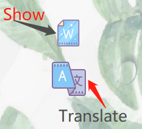

# RemV
**Note：This open source follows Mozilla Public License, v. 2.0, and the right of authorship is comopletely held by Lingao, Xiao.**  
**注意: 这个开源项目遵从Mozilla公共许可证，著名权被 *肖凌奥* 全权持有.**
- This is a multi-platform software that can run without python environment.
## Download
**Windows**: *https://share.weiyun.com/53OJHOc* Code: t5qsb1
  - It is Beta Version
  - **RemV.exe** is the executable application.
  - WordBook Repository is where you can find the book you need.
    - Then upload through RemV app.  
**MacOS: ** 敬请期待...
## RemV is a software that helps Chinese to remember vocabularies.
- The Lastest Version is written with PYQT_5
- It can be easily used and applied to users who are not Chinese in recent future. 
### Things to add
- [X] A quick word entry system.
- [X] A vocabulary list that automatically collects the wrong spelling words in Quiz Scene for later use.
### Tips for use

