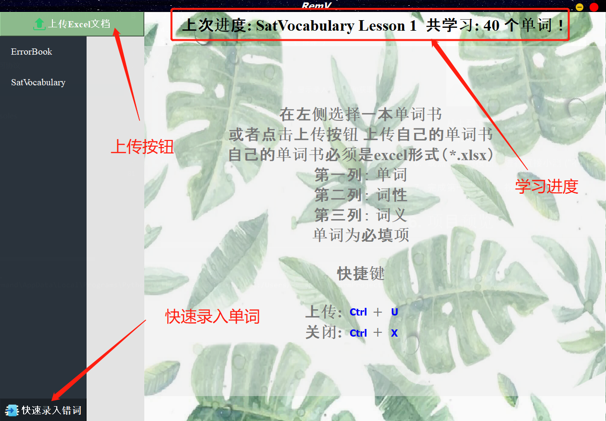
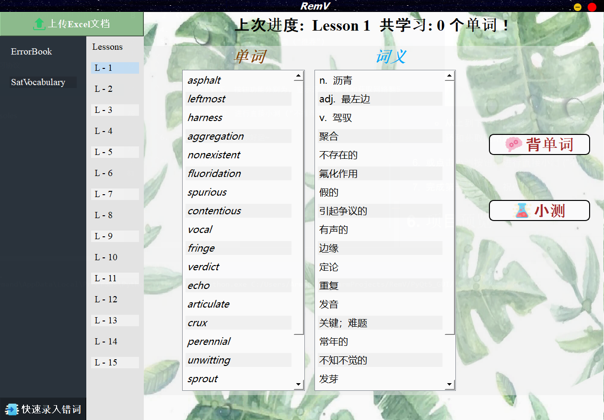
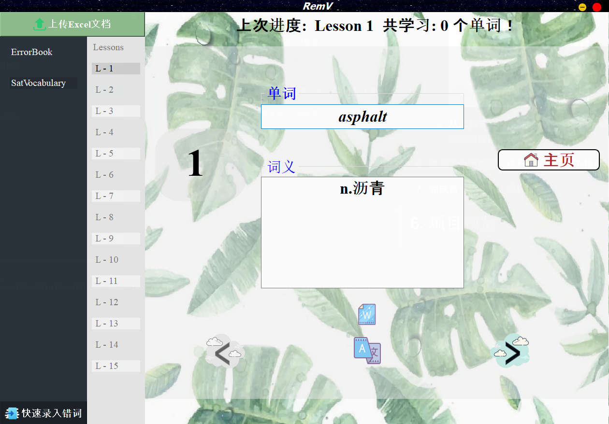
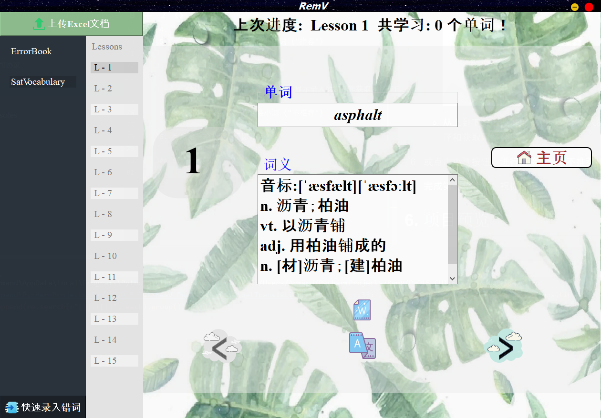
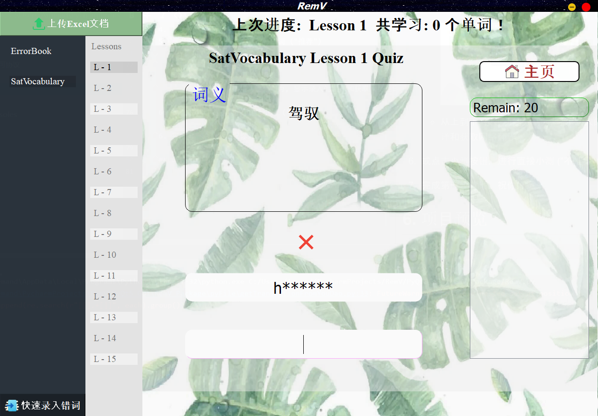
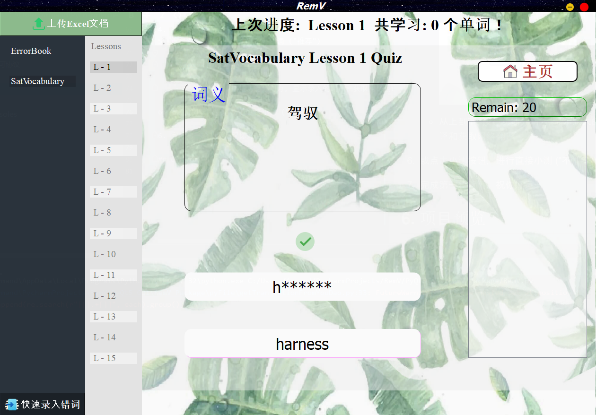
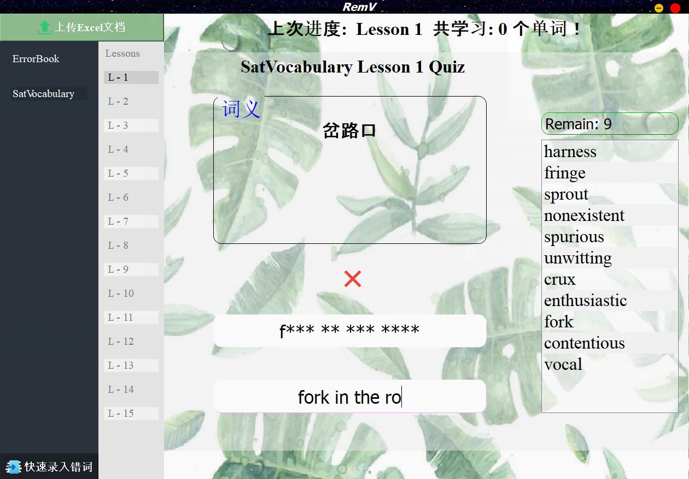
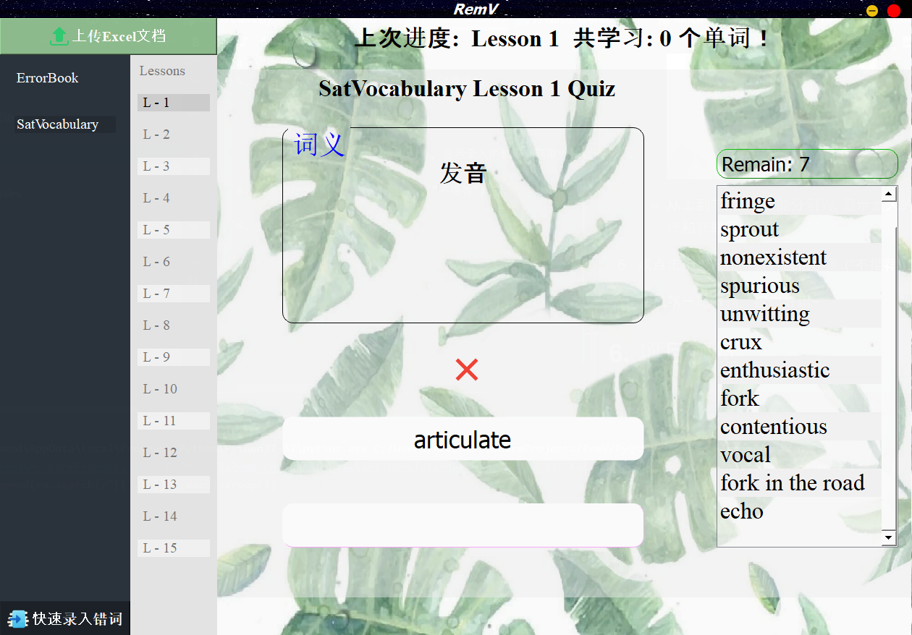

# RemV
**Note：This open source project follows [GNU General Public License v3.0](LICENSE), and the right of authorship is comopletely held by Lingao, Xiao.**  
**注意: 这个开源项目遵从 [GUN通用公开许可协议 v3.0](GUN通用公开许可协议)，著名权被 *肖凌奥* 全权持有.**
***
**Chinese Version <-- Click me**
***
- 此软件可以在多平台上运行

  

## Catalog
 

  [1.Why do I choose *RemV*](#First)  
  
  [2. Functions](#Second)  
  
  [3. **Download**](#Third)  
  
  [4. How to set up](#Fourth)  
  
  [5. How to use](#Fifth)  
  
  [6. Project preview](#Sixth)  
  

  

## 1. Why do I choose *RemV*
[Go to Catalog](#Catalog)

> RemV is a software that helps to build long-term memory of vocabularies.
#### Distinguishing from other softwares, **RemV** has three sections of memorizing.
1. Memorizing
2. Confirmation
3. Quiz 

The combination of these three rounds helps to fasten the foundation.
#### Why do I create this software in PC clients instead of mobile ones.
- Moblie clients are hard to check spellings of words. A relative tiny keyboard 
increases the probablities of making mistakes. As a result, 
it is a waste of time about reciting words that have been already mastered.
- People have hard time paying attention to the software only in moblie clients.
- Most of mobile sotfwares do not have a way to upload their own vocabulary list.
#### Compared with books, what are the **pros** of RemV. 
- Experiening a period of reciting words, I do think using a book makes people sleepy. 
Especially for learner whose native language is not English.
  - Continuous interaction prevents sleepness.
- Books cannot automatically collects wrong-spelling words.

## 2. Functions 

[Go to Catalog](#Catalog)

## General
- [x] 可上传总结好的生词书 (*.xlsx)
    > 总是背这几本单词书，人家有自己总结好的生词！
- [x] **可以快速录入生词**
    > 生词总结在了书本上, 一个个输入进excel太麻烦了！！
    - 不要担心, RemV提供快速录入
    - 只需要在RemV输入单词，词性和翻译**自动补全**~
    - 连excel都不用你打开
    - 在你的电脑上生成对应的excel文件
- [x] 书本自动划分成20个单词为一节课
- [x] 学习进度记录，不用担心忘记上次学到哪里了
- [x] 学习总单词数记录，成就感满满的 o(\*￣▽￣\*)ブ

### 记忆环节
- [x] 在线获取单词读音，词性，以及对应的释义
- [x] 可显示/隐藏单词解释

### 测试环节
- [x] 根据提示输入正确单词，拼写检测
- [x] 实时拼写检测，避免不必要的错误，节省时间
- [x] 错词回滚，输错了，你以为一遍就可以过了？
- [x] 错词自动加入错题本：都错了哪些词，不记得了？不要担心！  

  

## 3. 下载 (Download)  

[回到目录](#Catalog)

### Windows: https://github.com/ArmandXiao/RemV/releases/tag/Beta-Version
  - 测试版本已发布.
  - **RemV.exe** 是可执行文件.
  - **[WordBook Repository](#WordRepository)** 是整合的书籍的目录.
    - 下载想要背的单词书.  
    - 通过RemV上传.
### MacOS: 敬请期待...

  

## 4. 如何安装

[回到目录](#Catalog)  

1. 下载RemV_setup.exe
2. 根据安装提示，安装RemV
3. 打开RemV文件夹
4. 下拉，找到RemV.exe
5. 双击启动  
6. *可选：右键RemV.exe, 创建快捷方式，剪贴快捷方式到桌面 
7. 若出现对话框，则成功运行 

**切记不可讲RemV.exe移动至其他文件夹或目录**  

  

## 5. 如何使用  

[回到目录](#Catalog)  

  

1. 下载需要的单词库
    - 链接: *https://share.weiyun.com/53OJHOc* Code: t5qsb1  
2. 点击左上角上次按钮，上次下载好的，想要学习的excel
3. 点击书的名字
4. 点击想学的课程
5. 点击右侧背单词按钮，开始背单词 ("推荐")
    - 提示  
      
    
    - **从上到下, 按钮功能分别为, 显示录入的翻译和获取网络翻译**  

6. 或点击小测按钮，进行直接小测 ("不推荐")  
7. 完成第一轮背诵，祝你好运~  

  

## 6. 项目预览  

[回到目录](#Catalog)

-  
-  
-  
-  
-  
-  
-  
-  
