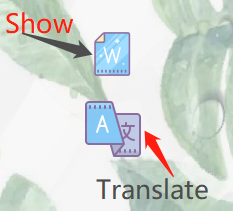
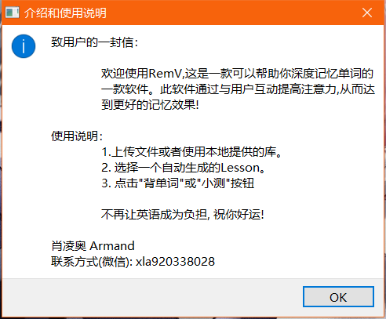
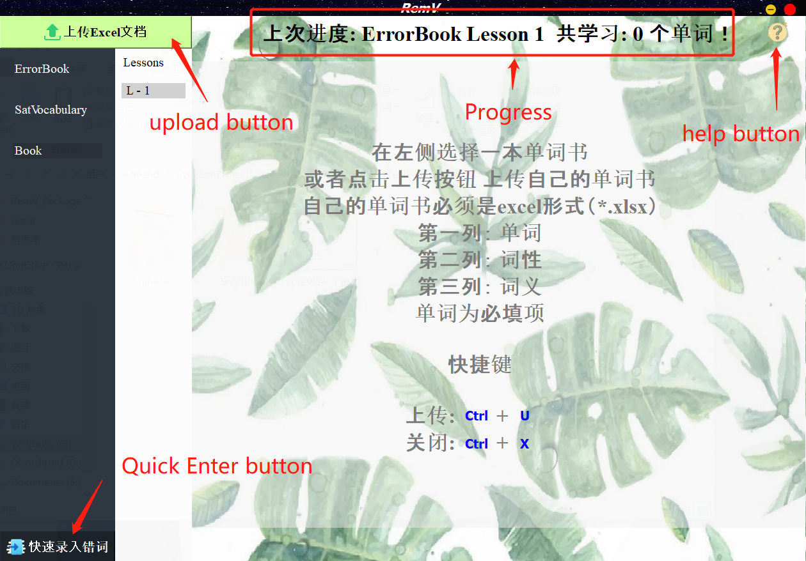
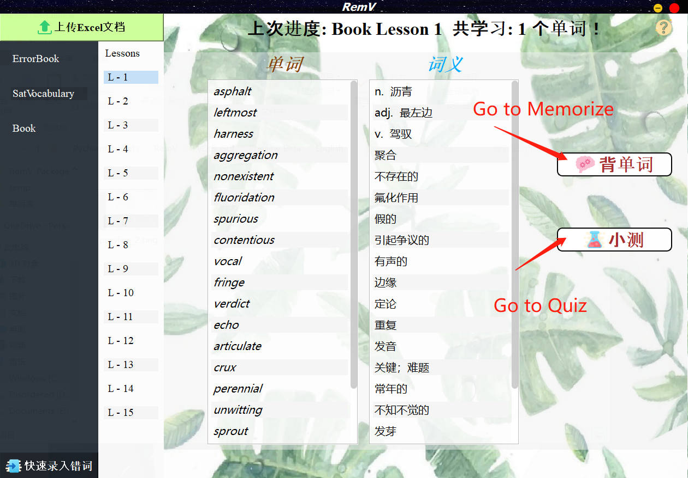
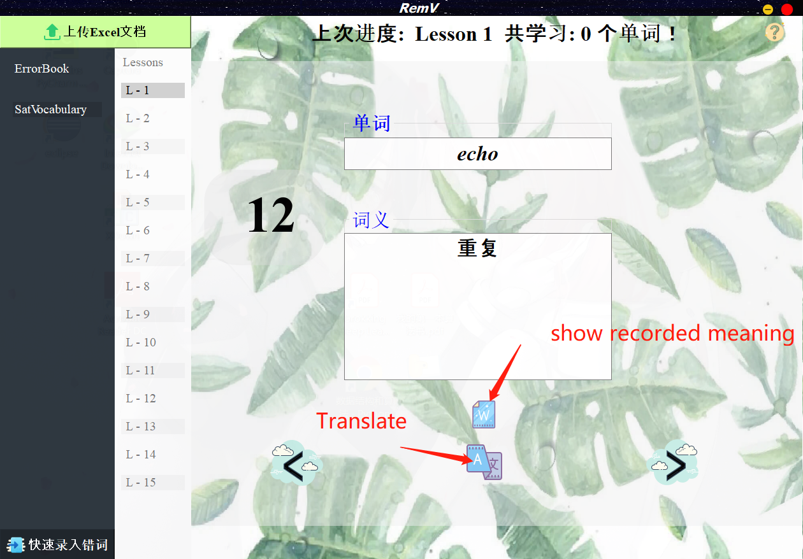
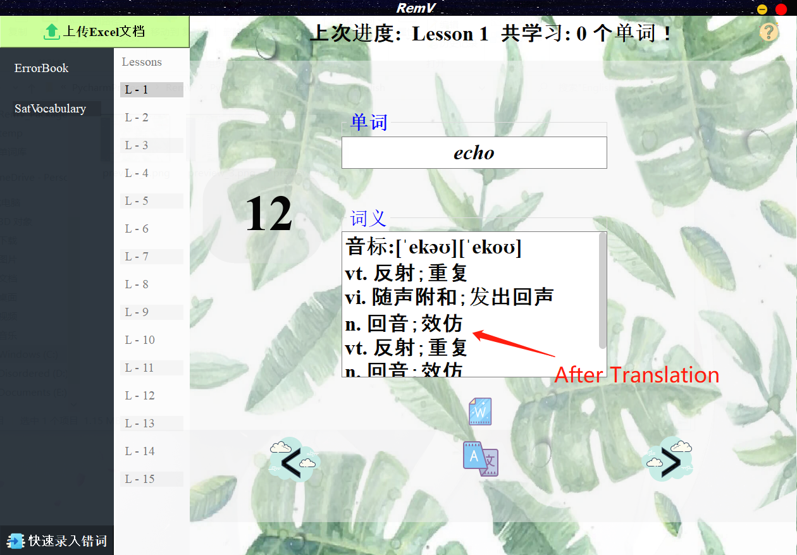
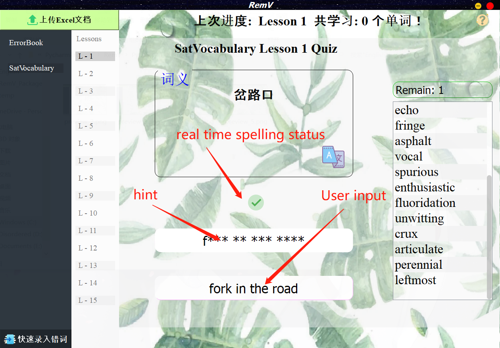
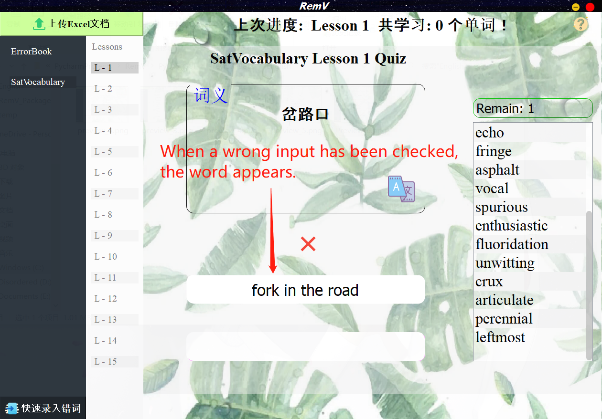

# RemV
**Note：This open source project follows [GNU General Public License v3.0](LICENSE), and the right of authorship is comopletely held by Lingao, Xiao.**  
**注意: 这个开源项目遵从 [GUN通用公开许可协议 v3.0](GUN通用公开许可协议)，著名权被 *肖凌奥* 全权持有.**
***
**[中文版](README.md) <- 点我**
***
- This software can run on multi-platform.

  

## Catalog
 

  [1.Why do I choose *RemV*](#First)  
  
  [2. Functions](#Second)  
  
  [3. **Download**](#Third)  
  
  [4. How to set up](#Fourth)  
  
  [5. How to use](#Fifth)  
  
  [6. Project preview](#Sixth)  
  

  

## 1. Why do I choose *RemV*
[Go to Catalog](#Catalog)

> RemV is a software that helps to build long-term memory of vocabularies.
#### Distinguishing from other softwares, **RemV** has three sections of memorizing.
1. Memorizing
2. Confirmation
3. Quiz 

The combination of these three rounds helps to fasten the foundation.
#### Why do I create this software in PC clients instead of mobile ones.
- Moblie clients are hard to check spellings of words. A relative tiny keyboard 
increases the probablities of making mistakes. As a result, 
it is a waste of time about reciting words that have been already mastered.
- People have hard time paying attention to the software only in moblie clients.
- Most of mobile sotfwares do not have a way to upload their own vocabulary list.
#### Compared with books, what are the **pros** of RemV. 
- Experiening a period of reciting words, I do think using a book makes people sleepy. 
Especially for learner whose native language is not English.
  - Continuous interaction prevents sleepness.
- Books cannot automatically collects wrong-spelling words.

## 2. Functions 

[Go to Catalog](#Catalog)

## General
- [x] Upload your own vocabulary list or book (*.xlsx)
    > I have my own book to uplaod. I don't want to **always** recite the same books.
- [x] **Quick Enter of words**
    > Words are summarized on books, and entering words in excels are so compliated and time-consuming!
    - Don't worry, *RemV* has quick enter function.
    - In RemV, you can ONLY enter the WORD itself; part of speech and corresponding meaning can be auto-filled with web-crawler.
    - You don't even need to open the excel.
    - RemV will also create the excel in `Rem/lib/res/word_repository`
- [x] Books are auto-seperated into lesson which contains at most 20 words.
- [x] Record the progess
- [x] Record the cumulative words you have remembered. When the number gets bigger, you will have sense of achievement. I swear. o(\*￣▽￣\*)ブ
- [x] Double Click to Remove a book. Note: the excel still remains on your computer.

### Memorizing Scene
- [x] Acquire part of speech and corresponding meanings of each POS online.
- [x] Able to hide/show the meanings of words.

### Quiz Scene
- [x] Words in quiz scene are given randomly.
- [x] Hint of the word is shown, including the length of the word, the spaces, and the start letter.
- [x] Real time spelling-cheking, which avoids unnecessary mistakes.
- [x] Rollback of wrong-spelling words.
- [x] All words that you have spelled incorrectly will be written in `Error Book`.

  

## 3. Download

[回到目录](#Catalog)

### Windows: https://github.com/ArmandXiao/RemV/releases/tag/Beta-Version
  - Beta-Version is now released.
  - **`RemV.exe`** is the executable software.
  - **[WordBook Repository](#WordRepository)** is the library where I integrate the resources of popular book.
    - Download the ones that you need.
    - Then upload in **RemV**
    - ENJOY your journey.
### MacOS: Stay tuned...

  

## 4. How to set up

[Go to Catalog](#Catalog)  

1. Download `RemV_setup-Beta-Version.exe`
2. According to setup information, install it on your computer.
3. Open `RemV` file
4. Scroll down, find `RemV.exe`
5. Double click `RemV.exe`
6. *Optional*：Right click `RemV.exe` -> created a shortcut -> cut the shortcut on to your Desktop -> Rename
7. If there is Dialog jumping out, that means you have successfully run.

**PLEASE, DO NOT MOVE `RemV.exe` TO OHTER FILE**  

  

## 5. How to use  

[Go to Catalog](#Catalog)  

  

1. Download books that you need.
    - link: *https://share.weiyun.com/53OJHOc* Code: t5qsb1  
2. Click the button on top-right corner -> upload the book you have downloaded.
3. Click the name of the book
4. Click a lesson
5. Click Memorize on right part ("RECOMMANDED")
    - Tip 
      
    
    - **From top to bottom, the functions are Show Meaning and Translate, respectively.**  

6. Click Quiz on the right part, to start a quiz directly. ("**NOT** RECOMMANDED")
7. Complete!

  

## 6. Project Preview.

[Go to Catalog](#Catalog)

-  
-  
-  
-  
-  
-  
-  
